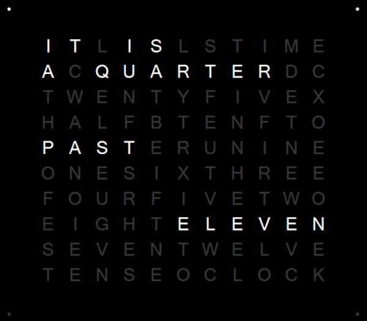
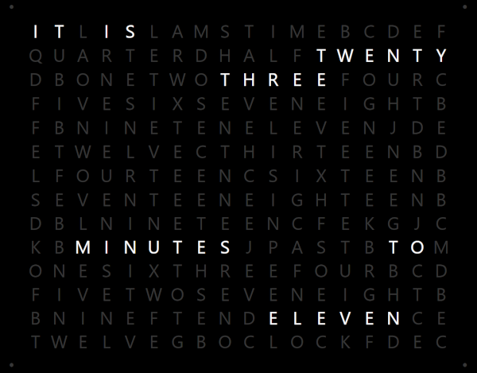
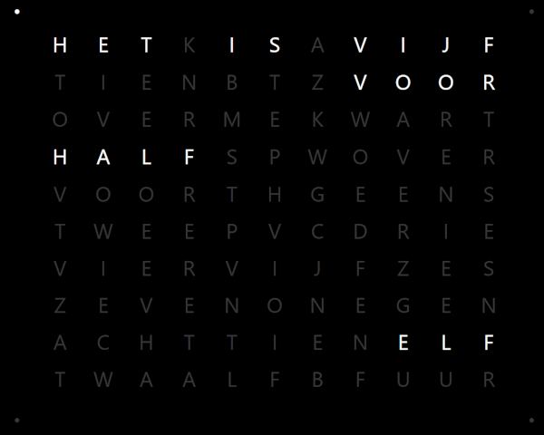
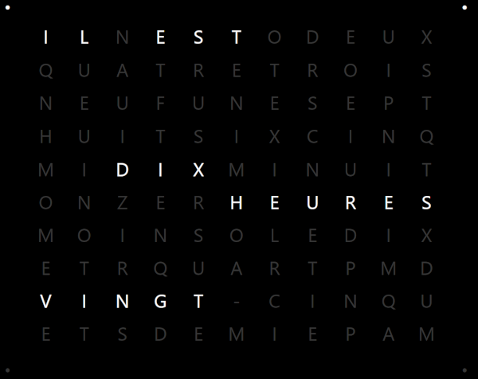

# Overview

A [QLOCKTWO](https://www.qlocktwo.com/en-de/earth/90/black-pepper)-inspired full-screen/screensaver application. 
Multilingual with support for 5-minute and 1-minute resolutions.

Uses and includes a multilingual implementation of a word clock algorithm that converts a timestamp to its text
representation and then to a bit-mask for an LED grid.

Targets .NET 10.
Uses Avalonia to allow cross-platform use (tested on Windows and Raspberry Pi).

This repo builds on previous work from the repos below but with significant enhancements and additions:
 - [https://github.com/TheBauwssss/TimeInWords](https://github.com/TheBauwssss/TimeInWords)
 - [https://github.com/sedrubal/WordClockScr](https://github.com/sedrubal/WordClockScr)

See [blog series](https://mikevanoo.co.uk/blog/modernise-crossplatform-windows-desktop-app-part1/) that discusses the 
solution in more detail when it was modernised and cross-platformed.

# Full-screen/Screensaver Application



# 5-Minute and 1-Minute Resolutions

In the 5-minute resolution display, the time is rounded down to 5-minute intervals with the four “dots” around the outside 
(clockwise, starting from top-left) denoting the four minutes in between each interval, as shown above.

In the 1-minute resolution display, the time is is written out in full:



# Multilingual Support

At present the clock supports English, Dutch, French and Spanish. Other languages can be added with ease.

For example:





# Word Clock Algorithm


## Using the time-to-text functionality

###### Code
```c#
LanguagePreset.Language lang = LanguagePreset.Language.English;
string text = TimeToText.GetSimple(lang, DateTime.Now);
```

###### Output
```
IT IS A QUARTER PAST TEN
```

## Using the text-to-grid functionality

### Displaying a time string

###### Code
```c#
TimeGrid grid = new TimeGridEnglish();
Bitmask bitmask = grid.GetBitMask("IT IS A QUARTER PAST TEN", true); //true: only accept exact word matches
string result = grid.ToString(bitmask);
```

###### Output
```
grid            bitmask         result

ITLISLSTIME     11011000000     IT.IS......
ACQUARTERDC     10111111100     A.QUARTER..
TWENTYFIVEX     00000000000     ...........
HALFBTENFTO     00000000000     ...........
PASTERUNINE     11110000000     PAST.......
ONESIXTHREE     00000000000     ...........
FOURFIVETWO     00000000000     ...........
EIGHTELEVEN     00000000000     ...........
SEVENTWELVE     00000000000     ...........
TENSEOCLOCK     11100000000     TEN........
```

### Displaying a generic string

###### Code
```c#
TimeGrid grid = new TimeGridEnglish();
Bitmask bitmask = grid.GetBitMask("HELLO", false); //false: accept partial matches
string result = grid.ToString(bitmask);
```

###### Output
```
grid            bitmask         result

ITLISLSTIME     00000000000     ...........
ACQUARTERDC     00000000000     ...........
TWENTYFIVEX     00000000000     ...........
HALFBTENFTO     10000010000     H.....E....
PASTERUNINE     00000000000     ...........
ONESIXTHREE     00000000000     ...........
FOURFIVETWO     00000000000     ...........
EIGHTELEVEN     00000010000     ......L....
SEVENTWELVE     00000000100     ........L..
TENSEOCLOCK     00000100000     .....O.....
```
